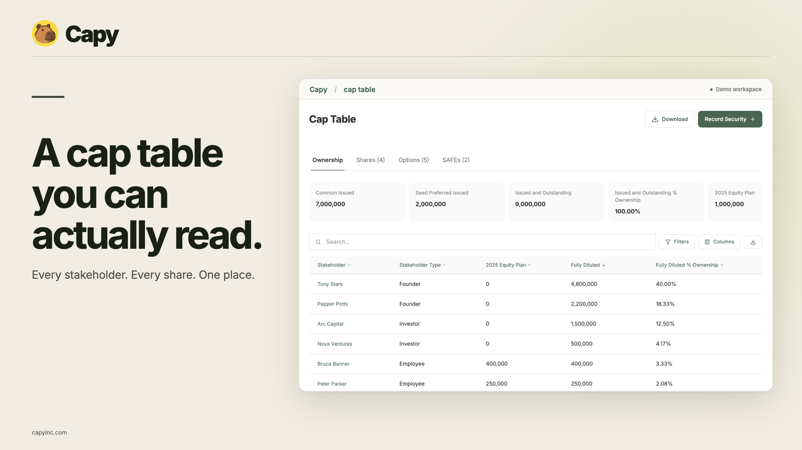
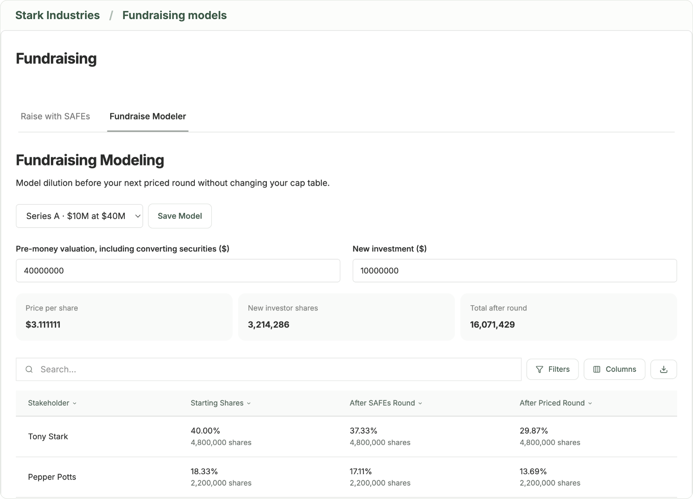
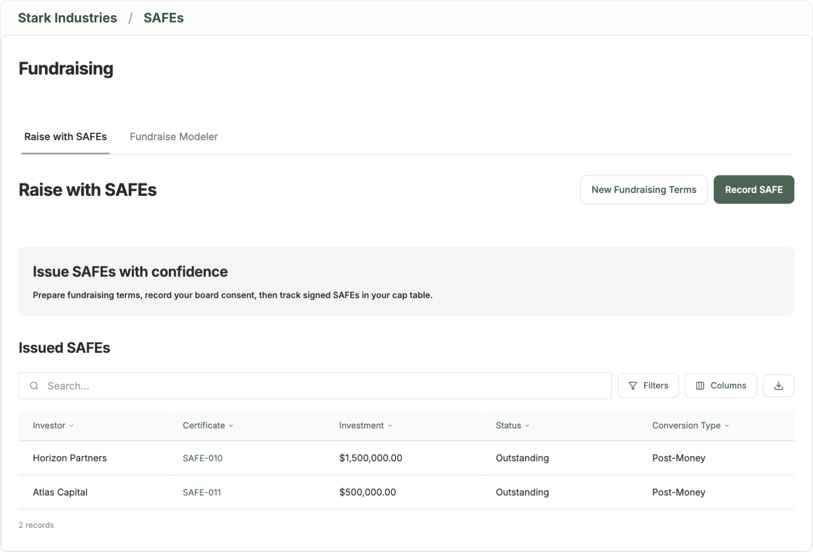

<p align="center">
  
</p>

<h1 align="center">Capy</h1>
<p align="center"><strong>One thing done well: your cap table.</strong></p>
<p align="center">Open-source cap table management for founders. Import from Pulley, manage equity, and take your data with you.</p>

<p align="center">
  <a href="https://github.com/zain/capy/actions/workflows/ci.yml"></a>
  <a href="LICENSE"></a>
  <a href="https://github.com/zain/capy/releases"></a>
</p>

<p align="center">
  <a href="https://capyinc.com">Use Capy</a> ·
  <a href="docs/SELF_HOSTING.md">Self-host</a> ·
  <a href="docs/MCP.md">AI apps</a> ·
  <a href="CONTRIBUTING.md">Contribute</a> ·
  <a href="ROADMAP.md">Roadmap</a> ·
  <a href="CHANGELOG.md">Changelog</a>
</p>



## Why Capy

We were Pulley customers too. We wanted a small, understandable product we could keep running, with code we could inspect and data we could export. So we built Capy.

This repository contains the web app, backend functions, equity calculations, import/export code, and deployment configuration. The hosted service at [capyinc.com](https://capyinc.com) runs this application. Self-hosted installations do not require a Capy subscription.

## What you can do

| Workflow                | Included                                                                                                                                                    |
| ----------------------- | ----------------------------------------------------------------------------------------------------------------------------------------------------------- |
| Bring your cap table    | Preview a detailed Pulley Excel export before signup; review reconciliation and warnings before saving; import contacts separately.                         |
| Manage equity           | Track stakeholders, shares, options, SAFEs, share classes, and equity plans. Record corrections, option exercises, and cancellations with activity history. |
| Understand ownership    | Review fully diluted ownership, plan reserves, and supported monthly vesting schedules. Search, sort, and filter the cap table.                             |
| Model fundraising       | Compare priced-round dilution with pre-money and post-money SAFEs, caps, and discounts; save scenarios.                                                     |
| Share with stakeholders | Give a stakeholder access to their own holdings through an invitation that can be claimed once and revoked.                                                 |
| Keep records            | Store documents and save approval, offer, and communication drafts.                                                                                         |
| Take your data          | Download the cap table as Excel and individual tables as CSV.                                                                                               |
| Use it from AI apps     | Connect Claude, ChatGPT, Cursor, or another AI app over MCP to read the cap table and draft changes for an admin to apply.                                  |

<details>
<summary><strong>See fundraising and SAFE screens</strong></summary>

### Model your next round



### Track your SAFEs



</details>

Screenshots use fictional companies and synthetic records.

### Current scope

Capy is a young project with a working hosted product. We publish the implementation, checks, and limitations so you can evaluate it yourself.

The current release does **not** send documents for signature, move money, file taxes, provide 409A appraisals, or automate legal-document generation. Open Cap Table Format export is on the [roadmap](ROADMAP.md); exports today are Excel and CSV. Email verification/password recovery delivery and administrator-team invitations are not yet implemented.

Read [supported workflows and boundaries](docs/FEATURES.md) and the [Pulley import guide](docs/PULLEY_IMPORT.md) before migrating a company.

### Use Capy from your AI app

Add `https://capyinc.com/mcp` to Claude, ChatGPT, Cursor, VS Code or another MCP client, sign in, and choose which companies the app can see. The app can read your cap table and, if you allow it, draft grants, exercises, cancellations, stakeholder updates and board consents. Nothing changes until an admin applies the draft in Capy. See [connecting AI apps](docs/MCP.md).

## Run locally

**Requirements:** Bun **1.3.14**, Node.js **24**, and your own Convex project. Stripe and Cloudflare credentials are not needed for local development.

```sh
git clone https://github.com/zain/capy.git
cd capy
bun install --frozen-lockfile
cp apps/web/.env.example apps/web/.env.local
bun run dev:setup
```

Create or select **your own** Convex project. Once the CLI has written `packages/backend/.env.local`, use a second terminal from the repository root to configure its development environment:

```sh
cd packages/backend
bunx convex env set SITE_URL http://localhost:3001
bunx convex env set BETTER_AUTH_SECRET "$(openssl rand -hex 32)"
bunx convex env set CAPY_SELF_HOSTED true
cd ../..
```

The setup command waits for a successful push; if it reports missing environment variables, leave it running while setting them. Copy the deployment's `.convex.cloud` and `.convex.site` URLs into `apps/web/.env.local`, then:

```sh
bun run dev
```

Open [localhost:3001](http://localhost:3001), create an account, and import a workbook or create an empty company. See the [development guide](docs/DEVELOPMENT.md) for the full environment reference and troubleshooting.

## Checks

```sh
bun run check    # formatting, lint, production build, and TypeScript
bun run test     # import/export, calculations, billing, and webhook tests
bun audit        # known dependency vulnerabilities
```

GitHub Actions runs these checks on pushes and pull requests, with a frozen lockfile and no production credentials. See [CONTRIBUTING.md](CONTRIBUTING.md) for the review and testing expectations.

## Architecture

| Part                          | Technology                          |
| ----------------------------- | ----------------------------------- |
| Web app                       | React, TanStack Start, TypeScript   |
| Database and server functions | Convex                              |
| Authentication                | Better Auth with the Convex adapter |
| Calculations and validation   | Decimal.js and Zod                  |
| Excel import/export           | ExcelJS                             |
| Tooling                       | Bun and Vite+                       |
| Hosted web deployment         | Cloudflare Workers                  |

```text
apps/web/               Routes, product UI, authentication, imports, exports, and the MCP server
packages/backend/       Convex schema, functions, permissions, and file storage
packages/equity/        Shared equity calculations, validation, and modeling
packages/ui/            Shared UI components
packages/infra/         Cloudflare deployment command
scripts/                Production build helper
docs/                   Setup, architecture, product scope, and migration guides
```

Read the [architecture guide](docs/ARCHITECTURE.md) for data flow and access boundaries. The [self-hosting guide](docs/SELF_HOSTING.md) covers deployment on your own Cloudflare and Convex accounts, updates, and backups. Running the Convex server itself on your infrastructure is not yet a tested deployment path for this repository.

## Maintainers and support

Built by [Zain](https://github.com/zain) and [Sina](https://www.linkedin.com/in/sinahartung/). Zain maintains this repository; [hello@capyinc.com](mailto:hello@capyinc.com) reaches the team.

- **Bugs and feature requests:** [open an issue](https://github.com/zain/capy/issues/new/choose).
- **Setup and usage questions:** [Discussions](https://github.com/zain/capy/discussions).
- **Private migration or account help:** [email us](mailto:hello@capyinc.com).
- **Security vulnerabilities:** use [private vulnerability reporting](https://github.com/zain/capy/security/advisories/new), as described in [SECURITY.md](SECURITY.md).

Please use synthetic examples in public issues. See [SUPPORT.md](SUPPORT.md) for what to include in a report.

## License and acknowledgments

Capy is licensed under **GNU AGPL v3.0** ([AGPL-3.0-only](LICENSE)). Contributions use the same license. Dependency and asset licenses remain with their respective authors; see [THIRD_PARTY_NOTICES.md](THIRD_PARTY_NOTICES.md).

Built with [Better T Stack](https://better-t-stack.dev), [TanStack](https://tanstack.com), [Convex](https://convex.dev), [Better Auth](https://better-auth.com), and [shadcn/ui](https://ui.shadcn.com). Capy is an independent project and is not affiliated with Pulley or Carta.
