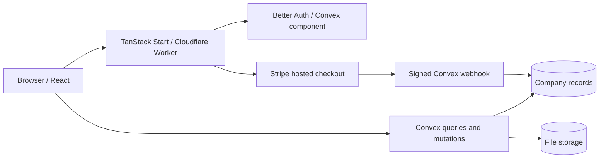

# Architecture

Capy is a Bun workspace with a TanStack Start web app and a Convex backend. There is no separate REST application server or ORM.

Stripe is used by the hosted service. Self-hosted mode does not require it.

## Import flow

1. ExcelJS reads a workbook in the browser. `packages/equity/src/import.ts` locates sheets and headers, normalizes records, and reconciles totals.
2. `/preview` stores a pending import in browser IndexedDB for up to 24 hours. It binds to the first signed-in account and is cleared after import or sign-out.
3. The user reviews warnings and confirms the import. Authenticated mutations stage batches under an import ID.
4. Finalization validates the staged records before marking the import active. Company queries use the active import.

The preview is not uploaded before confirmation. Contacts use a separate reviewed merge flow. Subsequent cap-table uploads create a separate snapshot/company rather than silently merging into an existing populated cap table.

## Equity calculations

`packages/equity` owns decimal arithmetic, schemas, totals, standard vesting projections, and fundraising models. Import and UI code share these helpers. Fully diluted totals combine outstanding stock, outstanding awards/warrants, and available plan reserves; unconverted SAFEs are modeled separately.

See [FEATURES.md](FEATURES.md) for the exact modeling and vesting boundaries.

## Authentication and authorization

Better Auth identifies users through its Convex component. Company mutations and queries enforce membership on the backend; administrator writes additionally require the admin role. Write paths use revision checks and activity records where implemented.

Portals have separate grants. An invitation can be claimed once, expires if unused, and can be revoked. A portal provides a stakeholder's own holdings, not company-wide data. File access is checked against company membership before returning download URLs.

## Billing

Hosted access is checked server-side through `requireEditing`. Viewing and exporting remain available after the editing period ends. Stripe events require valid signatures and matching mode, and processed events are recorded to avoid replayed entitlements.

`CAPY_SELF_HOSTED=true` keeps editing enabled and disables checkout on an independently operated backend. It never bypasses authentication, memberships, portal restrictions, or file permissions.

## Configuration

Public Convex URLs are browser build inputs. Authentication and webhook secrets belong on Convex. The Stripe API key belongs only in Cloudflare Worker secrets. `scripts/build-production.ts` binds a production web build to the deployment selected by Convex.

CI compiles with dummy public URLs and does not deploy or receive production secrets.

## Operational scope

Current automated tests focus on parsing, export round trips, calculations, billing policy, webhooks, and redirects. Live authorization and file-storage checks are manual acceptance work; passing CI is not evidence of an independent security audit. [SECURITY.md](../SECURITY.md) describes reporting and supported versions.
