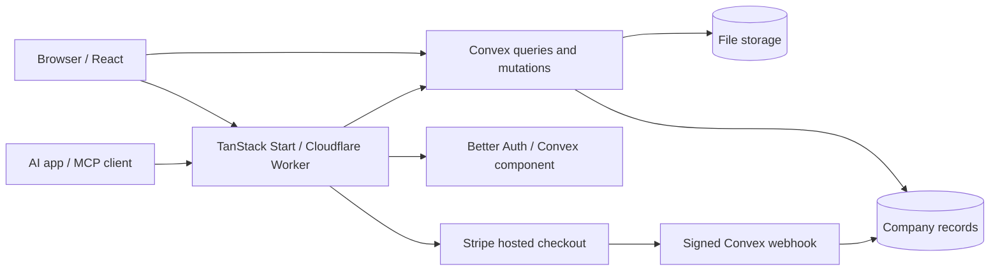

# Architecture

Capy is a Bun workspace with a TanStack Start web app and a Convex backend. There is no separate REST application server or ORM.

Stripe is used by the hosted service. Self-hosted mode does not require it.

## Import flow

1. ExcelJS reads a workbook in the browser. `packages/equity/src/import.ts` locates sheets and headers, normalizes records, and reconciles totals.
2. `/preview` stores a pending import in browser IndexedDB for up to 24 hours. It binds to the first signed-in account and is cleared after import or sign-out.
3. The user reviews warnings and confirms the import. Authenticated mutations stage batches under an import ID.
4. Finalization validates the staged records before marking the import active. Company queries use the active import.

The preview is not uploaded before confirmation. Contacts use a separate reviewed merge flow. Subsequent cap-table uploads create a separate snapshot/company rather than silently merging into an existing populated cap table.

## Equity calculations

`packages/equity` owns decimal arithmetic, schemas, totals, standard vesting projections, and fundraising models. Import and UI code share these helpers. Fully diluted totals combine outstanding stock, outstanding awards/warrants, and available plan reserves; unconverted SAFEs are modeled separately.

See [FEATURES.md](FEATURES.md) for the exact modeling and vesting boundaries.

## Authentication and authorization

Better Auth identifies users through its Convex component. Company mutations and queries enforce membership on the backend; administrator writes additionally require the admin role. Write paths use revision checks and activity records where implemented.

Portals have separate grants. An invitation can be claimed once, expires if unused, and can be revoked. A portal provides a stakeholder's own holdings, not company-wide data. File access is checked against company membership before returning download URLs.

## MCP server

The Worker serves a remote MCP server at `/mcp` (`apps/web/src/server/mcp`). Every Convex function it calls is in `packages/backend/convex/mcp.ts` and takes the caller's access token. [MCP.md](MCP.md) is the user guide; `apps/web/public/mcp.md` describes the tools for AI assistants.

Connecting (OAuth 2.1 with PKCE, Better Auth's `mcp()` plugin):

1. A request to `/mcp` without a valid token gets a 401 whose `WWW-Authenticate` header points to `/.well-known/oauth-protected-resource/mcp`. The Worker serves that and `/.well-known/oauth-authorization-server` from the request origin.
2. The client registers itself at `/api/auth/mcp/register` and opens `/api/auth/mcp/authorize`. Hooks in `convex/auth.ts` always require consent and always add `offline_access`, so every connection gets a refresh token. A request without S256 PKCE or `response_type=code` stops on Capy's error page instead of redirecting to the client, and unknown scopes are dropped, since anyone can register a client with any redirect URI.
3. A signed-out user signs in at `/connect`. The consent page `/connect/consent` shows the client's name and redirect host and asks which companies it can see and whether it may draft changes. `connections.approve` saves that as an `mcpGrants` row; only then does Better Auth issue the authorization code.
4. The client exchanges the code at `/api/auth/mcp/token` for a 1-hour access token and a 30-day refresh token. Refresh tokens rotate and are single-use: `connections.claimRefreshToken` claims each one in a single transaction before the exchange, so parallel requests can't each redeem it. Presenting an exchanged token again more than 30 seconds later revokes that app's tokens for the user.

Each MCP request:

1. The Worker checks the bearer token with `mcp.session` (cached for 30 seconds) and builds a stateless MCP server for the request. Tools are listed from the session, so `draft_change` exists only when the grant allows drafting.
2. Each tool calls one `mcp.*` function with the token and the current time. In one transaction, the function resolves token → user → grant → live membership, checks the company is in the grant, and looks up every key within that company. An invalid token becomes a 401 so the client refreshes or reconnects; other errors become tool errors.
3. Results are computed on the server and paged; the whole company is never returned. They carry relative Capy links, which the Worker makes absolute.

Drafts and files:

- `mcp.draftChange` needs a grant with drafting and the admin role. The shared change engine (`packages/equity/src/changes.ts`) validates the input with the same rules as the editor and stores a pending `changes` row with a preview. It changes nothing else.
- An admin with editing access applies or rejects the draft on `/companies/<id>/changes/<changeId>` (`changes.apply`/`reject`). Apply recomputes the change against the current cap table, refuses it if the import or target record changed, and runs the same helpers as the editor with the approving admin as the actor. The activity row records `via: "mcp"`, the change and the app.
- `get_document` creates a 15-minute code in `mcpDownloads`. `/mcp/files/<code>` redeems it, re-checks membership, and streams the file with `Content-Disposition: attachment` and a sandboxing CSP. Storage URLs are never given to the model.
- An hourly cron (`convex/crons.ts`) deletes expired download codes, verification rows and tokens, and marks pending drafts older than 7 days as expired.
- Disconnecting under Account → Connected apps deletes the grant, the user's tokens for that client and its consent rows.

## Billing

Hosted access is checked server-side through `requireEditing`. Viewing and exporting remain available after the editing period ends. Stripe events require valid signatures and matching mode, and processed events are recorded to avoid replayed entitlements.

`CAPY_SELF_HOSTED=true` keeps editing enabled and disables checkout on an independently operated backend. It never bypasses authentication, memberships, portal restrictions, or file permissions.

## Configuration

Public Convex URLs are browser build inputs. Authentication and webhook secrets belong on Convex. The Stripe API key belongs only in Cloudflare Worker secrets. `scripts/build-production.ts` binds a production web build to the deployment selected by Convex.

CI compiles with dummy public URLs and does not deploy or receive production secrets.

## Operational scope

Current automated tests focus on parsing, export round trips, calculations, the change engine, MCP formatting and OAuth metadata, billing policy, webhooks, and redirects. Live authorization and file-storage checks are manual acceptance work; passing CI is not evidence of an independent security audit. [SECURITY.md](../SECURITY.md) describes reporting and supported versions.
